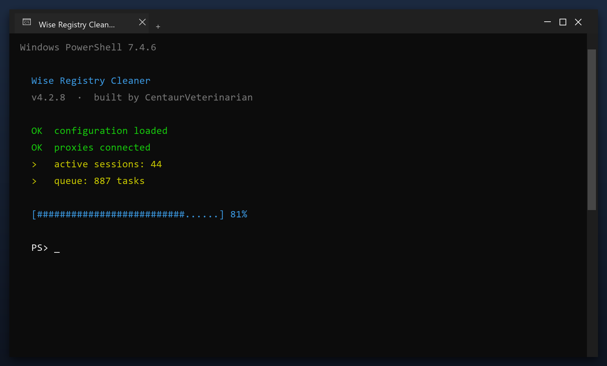

# Wise Registry Cleaner — Free Download [2026]

 

If your PC feels slower than it used to, **wise registry cleaner** is the fix. It clears the clutter that builds up over months of use and restores the speed you had on day one. Current 2026 build for Windows 10 and 11.

  

  

## Questions & Answers

**What exactly does it clean?**

Temporary files, caches, logs, broken shortcuts and unused leftovers. You see a list before anything is removed.

**How long does a scan take?**

One to three minutes for a quick scan; a deep scan takes longer.

**Is it safe for a work PC?**

Yes. It makes a restore point first and never touches your documents.

**Does it send data anywhere?**

No. There is no telemetry and no cloud upload - it is fully local.

## What Is It

Wise registry cleaner is a small Windows tool for routine maintenance. You do not need to understand the technical details - it reports what it found in plain language and only changes things after you agree. Nothing runs in the background and nothing phones home.

| **Term** | **Meaning** |
| --- | --- |
| **Plain language** | No technical jargon |
| **Report** | A summary of what was found |
| **Confirm** | You approve before changes |
| **No telemetry** | Nothing is sent anywhere |

## The Problem

- **Slower over time** - a PC never stays as fast as it was new
- **Long shutdowns** - Windows waits on stuck programs
- **High memory use** - idle apps keep eating RAM
- **Registry bloat** - thousands of dead entries
- **Messy downloads** - duplicate files everywhere

## The Fix

| **Problem** | **Solution** |
| --- | --- |
| **Disk almost full** | Reclaim gigabytes safely |
| **Programs fight for RAM** | Close what you do not need |
| **Leftover drivers** | Remove old device software |
| **Temp files return** | Scheduled automatic cleanup |
| **No clear report** | A simple space breakdown |

## Step by Step

1. **Get the file** with the button below
2. **Allow** it in Windows SmartScreen (More info, Run anyway)
3. **Open** the tool
4. **Press Start scan** and wait a couple of minutes
5. **Click Clean** to remove what was found

> **Note:** make sure your work is saved before a deep clean. The tool creates a restore point, but saving first is always wise.

## Features

| **Feature** | **Details** |
| --- | --- |
| **Size** | Small download, quick install |
| **Scan speed** | Typically under 3 minutes |
| **Background use** | None when closed |
| **Ads** | None |
| **Bundled extras** | None |
| **Offline** | Works without internet |

## Requirements

| **Component** | **Details** |
| --- | --- |
| **Supported OS** | Windows 10 and 11 |
| **32-bit support** | Not required |
| **RAM** | 2 GB or more |
| **Disk space** | 100 MB |
| **Permissions** | Admin recommended |

## What You Get

| **Component** | **Details** |
| --- | --- |
| **Main tool** | Latest 2026 build |
| **Guide** | Step-by-step setup |
| **FAQ** | Common questions |
| **Support** | Via the issues section |

## Tips

- Run the first scan with admin rights for full results
- Let it finish - do not close the window mid-scan
- Check the report before removing anything large
- Schedule a weekly scan if you use the PC daily
- Exclude the tool's own folder from antivirus

## Troubleshooting

| **Issue** | **Fix** |
| --- | --- |
| **Missing DLL error** | Install the Visual C++ runtime |
| **Crash on startup** | Update Windows and retry |
| **Report looks empty** | Run a deep scan instead of a quick one |
| **Cannot uninstall** | Use Windows Settings, Apps |

## Summary

In short: **wise registry cleaner** finds the clutter that slows your PC down and removes it safely. No accounts, no telemetry, no ads - just a small tool that works.

- Scans in minutes
- Creates a restore point first
- Works offline
- Free for personal use

**Download it above and run your first scan.**

---

*endless-garnet-569 · Updated 2026-10-09 · Shared under the MIT License*
